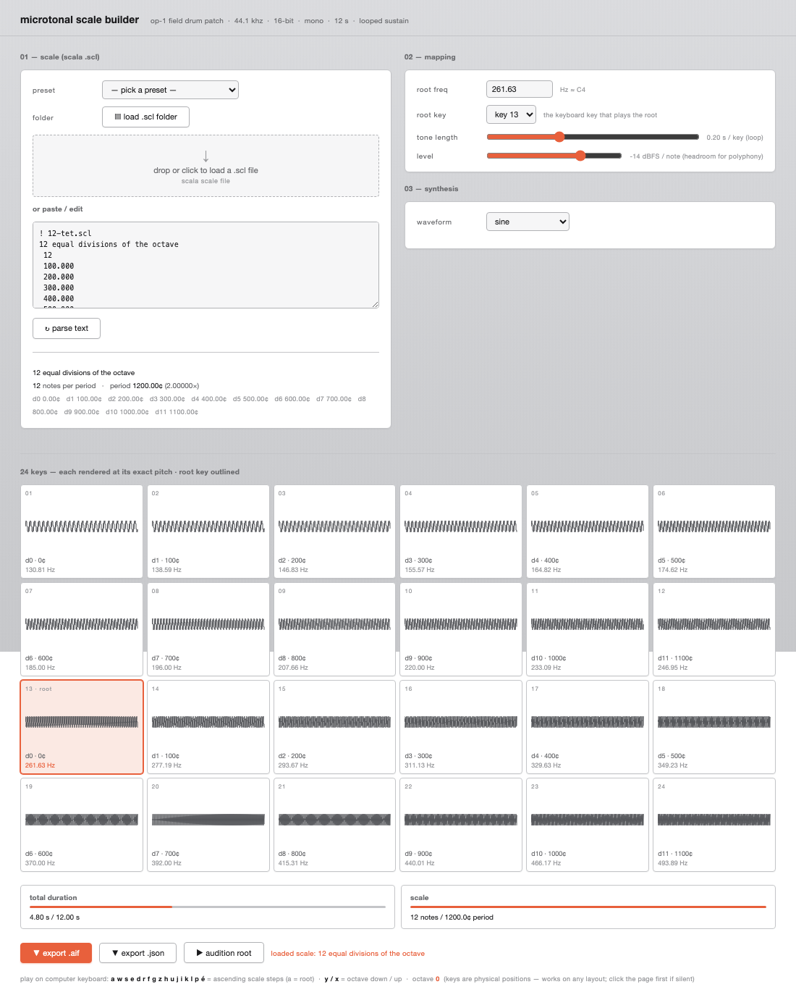

# microtonal scale builder — for the OP–1 field

Explore microtonal & non‑octave tunings on the **Teenage Engineering OP–1 field**.

Load a [Scala](https://www.huygens-fokker.org/scala/scl_format.html) `.scl` file, pick a
waveform, and the tool **synthesises one short, seamlessly‑looping tone per scale degree** and
bakes them into an OP‑1 field **drum patch** (`.aif`). Each key of the drum kit plays an exact
microtonal pitch, sustained for as long as you hold it.

It's a **single self‑contained HTML file** — no build step, no dependencies, nothing leaves your
browser. Just open it.



> ℹ️ The microtonality lives in the rendered audio (each slot is rendered at its true frequency
> with the patch's `pitch` field left at `0`), which sidesteps the OP‑1's semitone‑quantized pitch
> control and gives **exact tuning** — measured under **0.1 cents** of error across all keys.

---

## quick start

1. Open **`microtonal-op1f-builder.html`** in a desktop browser (Chrome, Edge, Safari or Firefox).
2. Pick a built‑in **preset**, drop in a `.scl` file, or load a whole **folder** of `.scl` files.
3. Set the **root frequency**, **root key**, **waveform** and **level**.
4. Audition with your **computer keyboard** (see below).
5. Click **export .aif** and drop the file onto your OP‑1 field as a drum patch.

No server needed — `file://` works. If you prefer one:

```bash
python3 -m http.server 8000
# then visit http://localhost:8000/microtonal-op1f-builder.html
```

---

## loading a scale

The Scala `.scl` format is supported in full (cents **and** ratios, arbitrary periods):

- **Preset** dropdown — 12‑TET, just‑intonation major (Ptolemy), 19‑TET, Bohlen–Pierce.
- **Single file** — drag‑and‑drop or click to load one `.scl`.
- **Folder** — *load .scl folder* reads every `.scl` in a directory (and its sub‑folders) and lists
  them in a dropdown, so you can flip through a whole tuning library. Files are read locally;
  nothing is uploaded.
- **Paste / edit** — paste raw Scala text and hit *parse text*.

The parser handles comment lines (`!`), the description line, the note count, and pitch lines as
either cents (`700.0`) or ratios (`3/2`). The implicit `1/1` is added automatically and the last
entry is treated as the period (an octave `2/1`, a tritave `3/1`, or anything else).

---

## controls

| control | what it does |
|---|---|
| **root freq** | Frequency (Hz) assigned to the root key. Shows the nearest note name. |
| **root key** | Which of the 24 drum keys the root sits on. The scale extends **up and down** from there, repeating every period. |
| **tone length** | Length of each rendered loop (0.05–0.5 s). Shorter = more headroom in the 12 s buffer. |
| **level** | Per‑note peak level in dBFS (default **−14 dB**) so stacked/polyphonic notes don't clip. |
| **waveform** | `sine` · `triangle` · `sawtooth` · `square` · **FM (2‑op)** (ratio + depth) · **custom additive** (8 harmonic faders). |

The 24‑key grid live‑updates, showing each key's scale degree, cents, and exact frequency, with the
root key highlighted. Click any key to audition it.

---

## playing on the computer keyboard

Audition the tuning before exporting:

```
 a  w  s  e  d  r  f  g  z  h  u  j  i  k  l  p  é      ← ascending scale steps (a = root)
 y / x                                                  ← octave down / up
```

- Fully **polyphonic** with seamless looped sustain while held.
- Keys are matched by **physical position**, so the same physical keys work on any keyboard layout
  (the labels above are Swiss QWERTZ).
- Browsers require a gesture before audio — click the page once if it's silent.

> The computer keyboard is for **monitoring only**; it doesn't change the exported file.

---

## using the export on the OP–1 field

1. Connect the OP‑1 field over USB and enter **content / disk mode**.
2. Copy the exported `.aif` into a **drum** preset folder (e.g. `/drum/`).
3. Select it in **drum** mode. Holding a key now sustains the corresponding microtonal pitch.

The exported patch is a standard OP‑1 drum kit, so per‑key tweaks on the device (volume, etc.) still
work from there.

---

## how it works

The output is a `.aif` exactly as the OP‑1 expects:

- **44.1 kHz · 16‑bit · mono · 12 s** AIFF, with the proprietary `op-1` JSON metadata embedded in an
  `APPL` chunk.
- The 24 tones are concatenated into the buffer; each slot's `start`/`end` mark its region,
  normalised over the buffer the way the OP‑1 stores sample positions.
- `playmode` is set to **`28672` (loop)** for every slot, so holding a key loops between `start` and
  `end` → sustained tone.
- `pitch` is `0` for every slot (tuning is in the audio, not the pitch field).

**Seamless loops:** each tone is rendered as an exact **integer number of waveform cycles**. The
fundamental is nudged by a fraction of a cycle so a whole number fit the slot length, which makes the
`start → end` loop click‑free. FM ratios and additive harmonics stay periodic at the fundamental, so
they loop cleanly too. Measured tuning error stays **< 0.1 cents**.

---

## compatibility & notes

- Built and tested against the OP‑1 field drum patch format; should also load on the original OP‑1
  and OP‑Z (same drum‑patch format).
- Output is mono. The OP‑1 field's stereo drum engine plays mono samples fine.
- The drum **loop** play‑mode value (`28672`) is community‑reverse‑engineered, not officially
  documented — verified against real patches and existing tooling. If a loop seam is ever audible,
  raise the *tone length* slightly.
- The folder picker needs a Chromium‑based browser, Safari, or Firefox on desktop.

---

## acknowledgements

- The [Scala scale file format](https://www.huygens-fokker.org/scala/scl_format.html) by Manuel Op de Coul.
- OP‑1 drum‑patch format details cross‑checked against
  [`schollz/teoperator`](https://github.com/schollz/teoperator) and
  [`brian3kb/digichain`](https://github.com/brian3kb/digichain).
- OP‑1 / OP‑1 field are products of [Teenage Engineering](https://teenage.engineering/). This project
  is unaffiliated and not endorsed by them.

---

## license

MIT — see below. (Swap this out if you prefer something else.)

```
MIT License

Copyright (c) 2026

Permission is hereby granted, free of charge, to any person obtaining a copy
of this software and associated files, to deal in the software without
restriction, including the rights to use, copy, modify, merge, publish,
distribute, sublicense, and/or sell copies, subject to the following:

The above copyright notice and this permission notice shall be included in all
copies or substantial portions of the software.

THE SOFTWARE IS PROVIDED "AS IS", WITHOUT WARRANTY OF ANY KIND.
```
